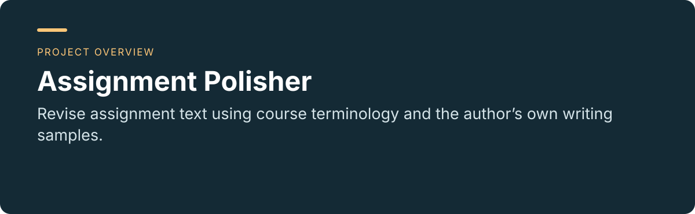
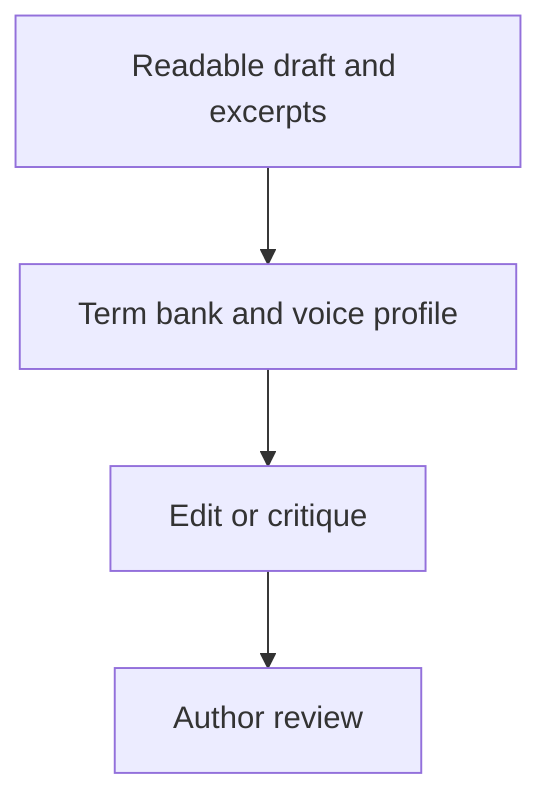

<p align="center"></p>

<p align="center"><a href="README.md"></a> <a href="README.zh-CN.md"></a></p>

# Assignment Polisher

**Revise assignment text using course terminology and the author’s own writing samples.**

[Project usage and maintenance](../README.md) · [Report an issue](https://github.com/thejaytang/assignment-polisher/issues)

## 1. What you can do

- Build a term bank and a voice profile before editing.
- Choose polish, polish+notes or critique while preserving facts and the author’s position.


## 2. Start here

Install this repository as a Codex skill following the [project guide](../README.md), then provide readable text.

```text
Use $assignment-polisher in polish+notes mode.
Revise the paragraph below using my course excerpt and writing sample.
Preserve the claims and citations; do not add facts.
```

## 3. Use cases

These are illustrative scenarios. Only explicitly linked execution artifacts represent checks performed for this update.

| Input or request | Expected result |
|---|---|
| Draft plus course excerpt | A revision with consistent course terminology |
| Draft plus writing sample | A restrained revision informed by observed voice patterns |
| A request for critique only | A diagnosis without rewriting |

### A small example

Illustrative input and output, not a claim about a real student.

- **Course excerpt:** Use the term “bounded rationality”.
- **Draft:** “The manager made an imperfect decision because people cannot know everything.”
- **Conservative revision:** “The manager's decision reflects bounded rationality: people cannot know everything.”
- **Review note:** The supplied course term replaces a loose description. No personal experience or new evidence is added; the author must confirm that the term fits the assignment context.



## 4. Requirements and current limits

A text-editing skill, not a PDF/OCR parser. Requires an agent capable of loading the skill files. Without adequate samples, it should make conservative edits rather than claim to know your voice. It must not invent personal experience, data or references, or promise detector evasion.

## 5. Documentation and sources

These links identify the implementation, operating instructions or related projects for a closer fit check.

- [Skill instructions](../SKILL.md)
- [Workflow details](../references/workflow.md)
- [Review scenarios](../references/eval-cases.md)

## 6. License and maintenance

No repository-wide license is declared at the root. This presentation update does not change the terms of code, data or third-party material; confirm permission for the material you want to reuse.

This is the public introduction. Linked project documents remain authoritative for operation, constraints and maintenance. Presentation updated: 2026-09-22.
