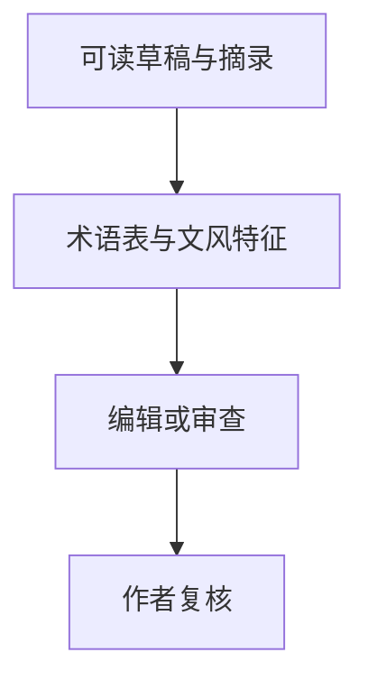

<p align="center"></p>

<p align="center"><a href="README.md"></a> <a href="README.zh-CN.md"></a></p>

# Assignment Polisher

**结合课程术语与作者自己的写作样本，润色作业文本。**

[项目使用与维护入口](../README.md) · [报告问题](https://github.com/thejaytang/assignment-polisher/issues)

## 1. 能完成什么

- 编辑前先整理术语表与文风特征。
- 在保留事实与作者立场的前提下选择 polish、polish+notes 或 critique。


## 2. 从这里开始

按[项目指南](../README.md)将仓库安装为 Codex 技能，再提供可读取的文本。

```text
Use $assignment-polisher in polish+notes mode.
Revise the paragraph below using my course excerpt and writing sample.
Preserve the claims and citations; do not add facts.
```

## 3. 使用场景

以下为说明性场景；只有明确链接的运行产物才代表本次检查结果。

| 输入或请求 | 预期结果 |
|---|---|
| 草稿与课程摘录 | 课程术语一致的修改稿 |
| 草稿与写作样本 | 根据可观察文风特征作出的克制修改 |
| 仅要求 critique | 不改写正文的问题诊断 |

### 一个简短示例

以下是虚构输入与输出，不代表真实学生的作业。

- **课程摘录：** 使用术语 “bounded rationality”。
- **草稿：** “The manager made an imperfect decision because people cannot know everything.”
- **保守修改：** “The manager's decision reflects bounded rationality: people cannot know everything.”
- **修改说明：** 用用户提供的课程术语替换宽泛描述，不补充个人经历或新证据；作者仍需确认该术语适合当前作业语境。



## 4. 使用条件与当前边界

这是文本编辑技能，不负责 PDF/OCR 解析。需要能够加载技能文件的 Agent。样本不足时应采用保守修改，不能声称已经掌握你的文风。不得虚构个人经历、数据或参考文献，也不承诺规避检测。

## 5. 资料与来源

下面链接指向实现、操作说明或相关项目，便于进一步判断适用性。

- [技能指令](../SKILL.md)
- [工作流程](../references/workflow.md)
- [人工复核场景](../references/eval-cases.md)

## 6. 许可与维护

仓库尚未在根目录声明统一许可证；本次展示更新没有改变代码、数据或第三方材料的许可。复用前请确认对应材料的授权。

本页为对外介绍。具体操作、约束和维护说明以链接的项目文档为准。展示页更新：2026-09-22。
